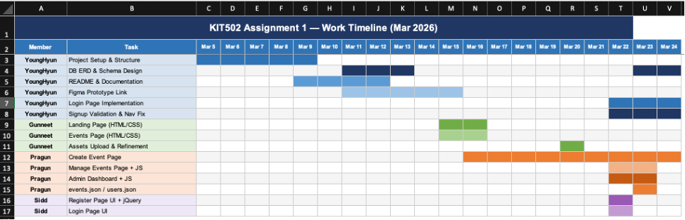
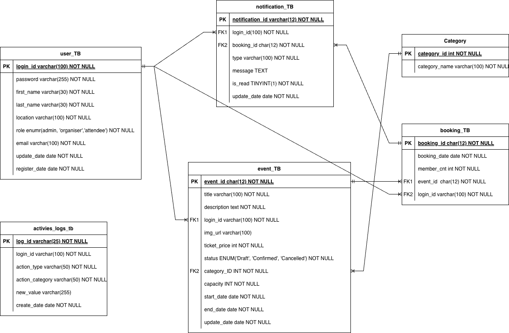

# 🎓 UTAS Student Tech Events

> **KIT502 Web Development** | University of Tasmania

A web application that gives UTAS students one place to find, organise, and join technology-related events — workshops, tech talks, hackathons, and networking sessions.

---

## 📋 Table of Contents

- [Project Overview](#project-overview)
- [Development Stages](#development-stages)
- [Color Palette](#color-palette)
- [System Roles](#system-roles)
- [Features](#features)
- [Pages](#pages)
- [Team Responsibilities](#team-responsibilities)
- [Database Design](#database-design)
- [Technology Stack](#technology-stack)

---

## Project Overview

UTAS Student Tech Events is designed for different types of users:

- **Visitors** — Browse available events
- **Students (Attendees)** — Register and book tickets
- **Organisers** — Post and manage events
- **Administrators** — Oversee the platform as a whole

The project is developed in two stages: frontend design & database planning (Assignment 1), then full-stack implementation using Laravel (Assignment 2).

---

## Development Stages

| Stage | Focus |
|-------|-------|
| Assignment 1 | Frontend design and database planning |
| Assignment 2 | Full-stack implementation using Laravel |

---

## Color Palette

> Source: [colorhunt.co](https://colorhunt.co)

| Role | Color Name | HEX |
|------|-----------|-----|
| Primary | Warm Orange | `#E76F51` |
| Secondary | Burgundy | `#7A1F2B` |
| Accent | Golden | `#F4A261` |
| Background | Cream | `#FFF7ED` |
| Surface | Ivory | `#FFE8D6` |
| Text | Dark Brown | `#3A1F1F` |

---

## System Roles

| Role | Description |
|------|-------------|
| **Visitor** | Can browse the landing page and view events. Cannot book tickets or modify anything. |
| **Attendee** | Can view events, book tickets, check registered events, and cancel bookings before the deadline. |
| **Organiser** | Can create, update, and delete events. Can also view attendee lists for their own events. |
| **Admin** | Highest level of access. Can manage users and organisers, review all events, and view system statistics. |

---

## Features

### Core Features

- User Registration and Login
- Role-based Access Control
- Event Creation and Management
- Ticket Booking System
- Event Filtering and Browsing
- Admin Dashboard with Statistics

### Advanced Features *(Optional)*

- Notification system
- Payment simulation
- Waitlist system when events are full
- Monthly event calendar

---

## Pages

| Page | Purpose |
|------|---------|
| Landing Page | Displays website information and featured events |
| Registration Page | Allows new users to create an account |
| Login Page | Allows existing users to sign in |
| Event Page | Displays the list of available events |
| Create Event Page | Organiser can create/add a new event |
| Event Management Page | Allows organiser/admin to update or delete existing events |
| Admin Dashboard | Displays users, events, and system statistics |

---

## Team Responsibilities

### Team Progress with Time line



The project is divided among 4 team members:

---

### YoungHyun Kim (`JayKimyh`) — Backend + Database + Managing

- Project initial setup
- README
- ERD & Schema
- Login page
- Nav bar
- Signup validation
- Merge management

---

### Gunneet (`guneet0526kaur-lang`) — Public Pages

- Landing page
- Events page
- CSS (`landing` / `events` / `variables`)
- Image assets

---

### Siddharth (Sidd) — Authentication

- Register page
- Login page *(committed by `JayKimyh` on Mar 22)*

---

### Pragun — Event & Admin Interfaces

Responsible for event management and administrative interfaces.

- Web page design using Figma — [View Prototype](https://www.figma.com/make/mbiRK198FnSLMnX3Euy4T8/TechEvents-UTAS-Website-Design?t=8Ns6RzjFmbkbWmbQ-1)
- Event creation form
- Event management page with dummy events *(shared JSON file)*
- Admin dashboard layout *(shared JSON file)*

---

## Database Design


### ERD Design



### Schema

```sql
/**
 * Author: YoungHyun Kim
 * Version: 0.1
 */

-- User Table (supports admin, organiser, attendee roles)
CREATE TABLE user_TB (
    login_id      VARCHAR(100) NOT NULL,
    password      VARCHAR(255) NOT NULL,
    first_name    VARCHAR(30)  NOT NULL,
    last_name     VARCHAR(30)  NOT NULL,
    location      VARCHAR(100) NOT NULL,
    role          ENUM('admin', 'organiser', 'attendee') NOT NULL,
    email         VARCHAR(100) NOT NULL,
    update_date   DATE         NOT NULL,
    register_date DATE         NOT NULL,
    PRIMARY KEY (login_id)
);

-- Event Category Table
CREATE TABLE category_TB (
    category_id   INT          NOT NULL,
    category_name VARCHAR(100) NOT NULL,
    PRIMARY KEY (category_id)
);

-- Event Table
CREATE TABLE event_TB (
    event_id     CHAR(12)     NOT NULL,
    title        VARCHAR(100) NOT NULL,
    description  TEXT         NOT NULL,
    login_id     VARCHAR(100) NOT NULL,
    img_url      VARCHAR(100),
    ticket_price INT          NOT NULL,
    capacity     INT          NOT NULL,
    status       ENUM('Draft', 'Confirmed', 'Cancelled') NOT NULL,
    category_ID  INT          NOT NULL,
    start_date   DATE         NOT NULL,
    end_date     DATE         NOT NULL,
    update_date  DATE         NOT NULL,
    PRIMARY KEY (event_id),
    FOREIGN KEY (login_id)    REFERENCES user_TB(login_id),
    FOREIGN KEY (category_ID) REFERENCES category_TB(category_id)
);

-- Booking Table
CREATE TABLE booking_TB (
    booking_id   CHAR(12)     NOT NULL,
    booking_date DATE         NOT NULL,
    member_cnt   INT          NOT NULL,
    event_id     CHAR(12)     NOT NULL,
    login_id     VARCHAR(100) NOT NULL,
    PRIMARY KEY (booking_id),
    FOREIGN KEY (event_id)  REFERENCES event_TB(event_id),
    FOREIGN KEY (login_id)  REFERENCES user_TB(login_id)
);

-- Notification Table (Beta v0.1)
CREATE TABLE notification_TB (
    notification_id VARCHAR(12)  NOT NULL,
    login_id        VARCHAR(100) NOT NULL,
    booking_id      CHAR(12)     NOT NULL,
    type            VARCHAR(100) NOT NULL,
    message         TEXT,
    is_read         TINYINT(1)   NOT NULL,
    update_date     DATE         NOT NULL,
    PRIMARY KEY (notification_id),
    FOREIGN KEY (login_id)   REFERENCES user_TB(login_id),
    FOREIGN KEY (booking_id) REFERENCES booking_TB(booking_id)
);

-- Activity Logs Table
CREATE TABLE activies_logs_TB (
    log_id          VARCHAR(25)  NOT NULL,
    login_id        VARCHAR(100) NOT NULL,
    action_type     VARCHAR(50)  NOT NULL,
    action_category VARCHAR(50)  NOT NULL,
    new_value       VARCHAR(255),
    create_date     DATE         NOT NULL,
    PRIMARY KEY (log_id),
    FOREIGN KEY (login_id) REFERENCES user_TB(login_id)
);
```

---

## Technology Stack

### Assignment 1 (Frontend)

- HTML
- CSS
- JavaScript
- jQuery

### Assignment 2 (Full-stack)

- Laravel (PHP)

---

*UTAS Student Tech Events — KIT502 Web Development, University of Tasmania*
