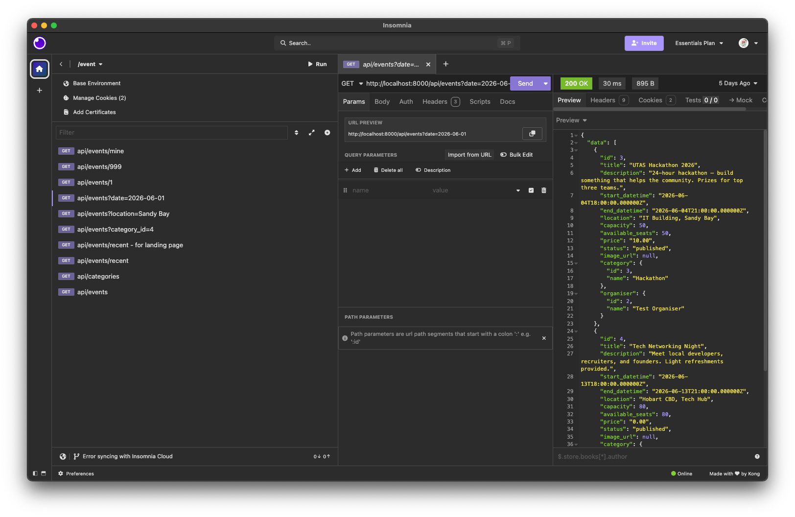
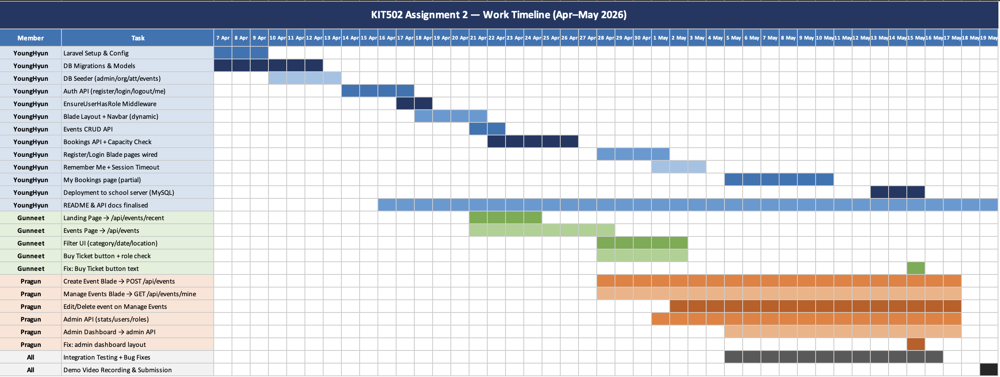

# 🎓 UTAS Student Tech Events

> **KIT502 Web Development** | University of Tasmania
> **Repository:** https://github.com/JayKimDeveloper/KIT502_GroupAssignment

UTAS Student Tech Events is a web application that gives UTAS students one place to find, organise, and join technology-related events — workshops, tech talks, hackathons, and networking sessions.

The project was first developed as a static frontend and database design project for Assignment 1. It has since been migrated to a Laravel-based full-stack application for Assignment 2.

---

## Project Overview

UTAS Student Tech Events is designed for four types of users:

- **Visitors** — Browse available events
- **Attendees** — Register, log in, book tickets
- **Organisers** — Create, update, and manage their own events
- **Administrators** — Manage all users and events, view platform statistics

The system provides a role-based event management platform where university-related technology events can be published, browsed, and booked.

---

## Assignment 2 Submission Information

### Usermin Project Path

```text
/groupwork/kit502-group-17/myApp
```

### Public Project URL

```text
http://192.168.200.4/groupwork/kit502-group-17/myApp/public/
```

### Database / phpMyAdmin URL

The final deployment uses MySQL on the university server. The database can be checked through phpMyAdmin:

```text
http://192.168.200.4/phpmyadmin
```

The MySQL login details are available in the group account file `kit502-group-17-mysql-pass.txt`.

### Marker Login Credentials

The following seeded accounts can be used by the marker to test the main system roles.

| Role | Email | Password |
|---|---|---|
| Admin | `admin@kit502.test` | `Admin123!@` |
| Organiser | `organiser@kit502.test` | `Organiser123!@` |
| Attendee | `attendee@kit502.test` | `Attendee123!@` |

The admin account should be used to evaluate administrator functions such as dashboard statistics, user management, event management, and role promotion/demotion.

### Demo Video

A 5-10 minute demo video is submitted separately through MyLO. The video demonstrates the main implemented features, including authentication, role-based navigation, event management, event listing, booking-related functions, and the admin dashboard.

---

## Development Stages

| Stage | Focus | Status |
|-------|-------|--------|
| Assignment 1 | Frontend design and database planning | ✅ Completed |
| Assignment 2 | Full-stack Laravel implementation | ✅ Completed with noted limitations |

### Final Assignment 2 Status

The Laravel full-stack application has been implemented for Assignment 2 and deployed in the group usermin directory. The main backend functions are complete, including authentication, role-based access control, event APIs, booking APIs, admin APIs, migrations, models, seeders, and database integration.

| Feature | Status | Notes |
|---|---|---|
| User registration | Completed | Visitor can register as attendee or organiser |
| Login / logout | Completed | Session-based authentication |
| Role-based navigation | Completed | Navbar changes based on login state and role |
| Role-based access control | Completed | Restricted pages and APIs are protected by middleware/checks |
| Landing page with recent events | Completed | Recent event data is loaded dynamically |
| Published events page | Completed | Events are retrieved from the database |
| Event filtering | Completed | Category/date/location filtering supported where implemented in the UI |
| Organiser event CRUD | Completed | Organisers can manage their own events |
| Admin dashboard statistics | Completed | Counts are retrieved from the database |
| Admin user management | Completed | Admin can manage and change user roles |
| Ticket booking API | Partially completed | Backend booking logic exists; final booking UI flow is not fully completed |
| Event detail page | Partially completed | Event detail functionality is still limited |
| Booking management page | Partially completed | Some attendee booking UI functions are still limited |
| Advanced features | Not included in final scope | Payment simulation, waitlist, and monthly calendar are optional and not fully implemented |

**Infrastructure:**

- SQLite was used during local development.
- MySQL is used for the final school usermin deployment.
- phpMyAdmin is available at `http://192.168.200.4/phpmyadmin`.
- API contract is documented in `docs/API_LISTS.md`.

---

## Technology Stack

### Frontend

- HTML, CSS, JavaScript
- jQuery v3.7.1
- Google Fonts: Poppins
- Google Material Icons

### Backend / Full-stack

- Laravel 10
- PHP 8.2
- Blade templates
- SQLite (local development), MySQL (final school server deployment)
- Composer, Git/GitHub

---

## Local Setup Guide

### 1. Clone Repository

```bash
git clone https://github.com/JayKimDeveloper/KIT502_GroupAssignment.git
cd KIT502_GroupAssignment
```

### 2. Install Dependencies

```bash
composer install
```

### 3. Create Environment File

```bash
cp .env.example .env
```

### 4. Generate Application Key

```bash
php artisan key:generate
```

### 5. Configure SQLite

Create an empty SQLite database file:

```bash
touch database/database.sqlite
```

Update `.env` so SQLite is used (the path is relative to Laravel's `database/` folder, so this works on every machine without editing):

```env
DB_CONNECTION=sqlite
DB_DATABASE=database.sqlite
```

> If Laravel can't find the file with the relative path on your machine, use an absolute path instead:
>
> ```env
> DB_DATABASE=/absolute/path/to/KIT502_GroupAssignment/database/database.sqlite
> ```

### 6. Run Migrations + Seed Test Data

```bash
php artisan migrate:fresh --seed
```

This creates all tables and populates them with:

- 1 admin, 1 organiser, 1 attendee (see [Test Accounts](#test-accounts) below)
- 5 categories
- 4 published events
- 1 sample booking

### 7. Link Storage (for event image uploads)

```bash
php artisan storage:link
```

This makes uploaded event images at `storage/app/public/events/` accessible via `/storage/events/...`.

### 8. Start Local Development Server

```bash
php artisan serve
```

Open in browser:

```
http://127.0.0.1:8000
```

### 9. Clear Caches When Things Look Stale

After pulling new changes or editing `.env`:

```bash
php artisan config:clear
php artisan route:clear
php artisan view:clear
```

---

## Test Accounts

After running `php artisan migrate:fresh --seed`, the following accounts are available for local testing:

| Role | Email | Password |
|---|---|---|
| Admin | `admin@kit502.test` | `Admin123!@` |
| Organiser | `organiser@kit502.test` | `Organiser123!@` |
| Attendee | `attendee@kit502.test` | `Attendee123!@` |

These accounts are also the marker login credentials for Assignment 2 testing.

---

## API Authentication (for frontend / Insomnia)

The backend uses **session-based authentication**, not tokens.

### From Blade pages (fetch calls)

Already handled by the shared layout. Just use `apiFetch()` if available, or include the CSRF token manually:

```js
fetch('/api/events', {
    method: 'POST',
    credentials: 'same-origin',
    headers: {
        'Accept': 'application/json',
        'Content-Type': 'application/json',
        'X-CSRF-TOKEN': document.querySelector('meta[name=csrf-token]').content,
    },
    body: JSON.stringify({ /* ... */ }),
});
```

### From Insomnia

CSRF is disabled on `/api/*` routes for development convenience, so you only need to log in once:

1. **POST** `http://localhost:8000/login`
   - Headers: `Accept: application/json`
   - Body (raw JSON): `{"email": "attendee@kit502.test", "password": "Attendee123!@"}`
2. Insomnia saves the session cookie automatically.
3. All subsequent `/api/*` calls work without further setup.

> See `docs/API_LISTS.md` for the full request/response contract.

### API Example

The screenshot below shows an example API request tested in Insomnia.




---

## Current Routes

### Page Routes (Blade views)

| Route | Page | View File |
|-------|------|-----------|
| `/` | Landing Page | `index.blade.php` |
| `/login` | Login | `login.blade.php` |
| `/register` | Registration | `register.blade.php` |
| `/events` | Events list | `events.blade.php` |
| `/create_event` | Create Event | `create_event.blade.php` |
| `/manage_events` | Event Management | `manage_events.blade.php` |
| `/my_bookings` | My Bookings (attendee) | `my_bookings.blade.php` |
| `/admin_dashboard` | Admin Dashboard | `admin_dashboard.blade.php` |

### Auth Actions (POST)

| Method | Route | Purpose |
|---|---|---|
| POST | `/register` | Submit registration |
| POST | `/login` | Submit login |
| POST | `/logout` | Log out |
| GET | `/me` | Current user info (used by navbar JS) |

### API Routes

Full request/response specs in [`docs/API_LISTS.md`](docs/API_LISTS.md).

| Method | Route | Who |
|---|---|---|
| GET | `/api/events` | Anyone |
| GET | `/api/events/recent` | Anyone |
| GET | `/api/events/{id}` | Anyone |
| GET | `/api/events/mine` | Organiser, Admin |
| POST | `/api/events` | Organiser, Admin |
| PUT | `/api/events/{id}` | Owner organiser, Admin |
| DELETE | `/api/events/{id}` | Owner organiser, Admin |
| GET | `/api/events/{id}/bookings` | Owner organiser, Admin |
| POST | `/api/bookings` | Attendee |
| GET | `/api/bookings/mine` | Attendee |
| DELETE | `/api/bookings/{id}` | Owner attendee |
| GET | `/api/categories` | Anyone |
| GET | `/api/admin/*` | Admin |

---

## API Documentation

Full request/response contract: [`docs/API_LISTS.md`](docs/API_LISTS.md) (last updated 13 May)

---

## Project Structure

```text
KIT502_GroupAssignment/
├── app/
│   ├── Http/
│   │   ├── Controllers/      # Auth, Event, Booking, Category, Admin controllers
│   │   └── Middleware/       # EnsureUserHasRole, VerifyCsrfToken (api/* excluded)
│   └── Models/               # User, Event, Booking, Category, Notification
├── bootstrap/
├── config/
├── database/
│   ├── migrations/           # users, categories, events, bookings, notifications
│   └── seeders/              # DatabaseSeeder (admin + sample data)
├── docs/
│   └── API_LISTS.md          # Full API contract
├── public/
│   ├── css/                  # variables.css, login_style.css, etc.
│   ├── data/
│   ├── images/
│   └── js/
├── resources/
│   └── views/
│       ├── partials/         # navbar.blade.php (shared across pages)
│       ├── layouts/          # app.blade.php (master layout)
│       └── *.blade.php       # page templates
├── routes/
│   └── web.php               # all routes (pages + API)
├── storage/
├── tests/
├── README.md                 # This file
├── composer.json
├── composer.lock
├── package.json
├── artisan
└── vite.config.js
```

---

## School Server Deployment Information

The final Assignment 2 project is deployed to the university-provided internal server (`usermin`) for marking. The final school server version uses MySQL as the active database.

Project path:

```text
/groupwork/kit502-group-17/myApp
```

Public URL:

```text
http://192.168.200.4/groupwork/kit502-group-17/myApp/public/
```

Database management URL:

```text
http://192.168.200.4/phpmyadmin
```

Database notes:

- The deployed school server version uses MySQL.
- Database credentials are stored in the group account file `kit502-group-17-mysql-pass.txt`.
- The Laravel `.env` file on the school server has been configured to connect to the MySQL database.
- Do not run `php artisan migrate:fresh --seed` on the final deployed database unless the database must be intentionally reset.

Recommended workflow for deployment or verification:

```bash
git pull
composer install --no-dev
php artisan migrate
php artisan config:clear
php artisan cache:clear
php artisan storage:link
```

The school server `.env` should use MySQL:

```env
DB_CONNECTION=mysql
DB_HOST=localhost
DB_PORT=3306
DB_DATABASE=<from kit502-group-17-mysql-pass.txt>
DB_USERNAME=<from kit502-group-17-mysql-pass.txt>
DB_PASSWORD=<from kit502-group-17-mysql-pass.txt>
```

Storage and bootstrap/cache permissions may need adjusting on the school server. Refer to deployment notes in the project notion / chat.

---

## Color Palette

> Source: [colorhunt.co](https://colorhunt.co)

| Role | Color Name | HEX |
|------|------------|-----|
| Primary | Warm Orange | `#E76F51` |
| Secondary | Burgundy | `#7A1F2B` |
| Accent | Golden | `#F4A261` |
| Background | Cream | `#FFF7ED` |
| Surface | Ivory | `#FFE8D6` |
| Text | Dark Brown | `#3A1F1F` |

---

## External Resources Used

- Laravel 10 documentation and framework conventions
- jQuery v3.7.1
- Google Fonts: Poppins
- Google Material Icons
- Color palette from ColorHunt
- Team-created or locally stored image assets in `public/images`

Image source details should be checked before the final MyLO submission if any third-party images are included.

---

## System Roles

| Role | Description |
|------|-------------|
| **Visitor** | Browse landing page and view events. Cannot book or modify anything. |
| **Attendee** | View events, book tickets, view registered events, cancel bookings before the cutoff. |
| **Organiser** | Create, update, delete their own events. View attendee lists for their events. |
| **Admin** | Manage all users (create/update/delete/promote/demote). Manage all events. View system statistics. |

---

## Features

### Core Features

- User registration and login (session-based)
- Role-based access control (admin / organiser / attendee / visitor)
- Event CRUD with image upload
- Event filtering (by category, date, location)
- Ticket booking with capacity validation (backend implemented; final UI flow partially completed)
- Booking cancellation until 1 day before the event (backend implemented; final UI flow partially completed)
- Admin dashboard with system statistics
- Admin user management (create/update/delete + role changes)

### Advanced Features *(optional)*

The following advanced features were considered but are not part of the completed final scope unless otherwise demonstrated in the running system:

| Advanced Feature | Status |
|---|---|
| Notification system | Database schema prepared / partial support |
| Payment simulation | Not fully implemented |
| Waitlist when events are full | Not implemented |
| Monthly calendar view | Not implemented |

---

## Pages

| Page | Purpose |
|------|---------|
| Landing Page | Website intro + 2 most recent events (dynamic) |
| Registration | Create attendee or organiser account |
| Login | Sign in (with Remember Me) |
| Events | List of published events with filters |
| Create Event | Organiser form to create an event |
| Event Management | Organiser sees their events; attendee booking view is partially completed |
| Admin Dashboard | Stats + user/event management for admins |

---

## Team Responsibilities

### Team Progress Timeline

## Assignment 01 Progress


## Assignment 02 Progress


---

### YoungHyun (Jay) Kim (`JayKimyh`) — Backend / Database / Auth

- Project setup, README management
- ERD and schema design
- Laravel project structure migration
- Database migrations, models, seeders
- Authentication API (register / login / logout / me)
- Events CRUD API
- Bookings API (ticket purchase, capacity check, cancellation)
- API contract documentation
- Login + Register pages wired to backend 


### Pragun (`pragun11`) — Prontend Lead - Event & Admin Interfaces

- Page design (Figma)
- Create Event form
- Event Management page
- Admin Dashboard layout
- Wiring create/manage/admin pages to backend API
- Admin API (stats, user management, role changes)


### Guneet (`guneet0526kaur-lang`) — Public Pages

- Landing page
- Events page (filtering UI + buy ticket flow)
- CSS for landing, events, variables
- Image assets
- Wiring the public pages to backend API (`/api/events`, `/api/events/recent`)

```
Please note that although some commits appear under my name (YoungHyun Kim), the actual development work was carried out by Guneet. I committed and pushed the code on her behalf, so the commit history does not accurately reflect the individual contributions for those parts.
```

### Siddharth (Sidd) — Login & Register Pages

- Develop login and Register front page

---

## Team Naming Rules

To keep the Laravel project consistent and maintainable, all team members should follow the naming rules below.

### General Naming Convention

| Target | Rule | Example |
|---|---|---|
| Database tables | Plural `snake_case` | `users`, `events`, `bookings` |
| Database columns | `snake_case` | `start_datetime`, `booking_reference` |
| Form input names | `snake_case` | `password_confirmation`, `category_id` |
| HTML IDs | `camelCase` | `createEventForm`, `bookingQuantity` |
| JavaScript variables | `camelCase` | `eventTitle`, `bookingQuantity` |
| CSS classes | `kebab-case` | `event-card`, `stats-card` |
| Route names | Dot notation | `events.store`, `admin.dashboard` |
| URLs | `snake_case` | `/create_event`, `/manage_events` |

### Fixed Value Naming

#### User Roles
```
admin, organiser, attendee
```

#### Event Statuses
```
draft, published, cancelled
```

#### Booking Statuses
```
confirmed, cancelled
```

#### Payment Statuses
```
free, unpaid, paid
```

### Form Input Naming

#### Register Form
```
role, name, email, password, password_confirmation
```

#### Login Form
```
email, password, remember
```

#### Create Event Form
```
title, description, category_id, start_datetime, end_datetime,
location, capacity, price, status, image
```

### Notes

- Database values should use lowercase names.
- Form `name` attributes must match controller validation keys.
- Use Laravel's `route()` helper or `url()` instead of hardcoding `.html` links.
- Uploaded event images use `image` as the form input name; stored in DB as `image_path`.

---

## Team Expectations and Work Quality Standards

- **Communication:** WhatsApp group chat.
- **Internal Deadline:** Aim to complete assigned work at least 3 days before the final submission deadline.
- **Work Quality:** Code should be checked before commit and reviewed after commit where possible.
- **Task Distribution:** Each member is responsible for at least one screen and related functionality.
- **Mutual Support:** Ask questions, provide help, and review each other's work when needed.

---

## Database Design

### ERD


> The ERD above was the original Assignment 1 design. The Laravel migrations have been refactored to follow Laravel conventions (plural `snake_case` tables, `id` BIGINT auto-increment primary keys, FK constraints, timestamps). See actual schema below.

### Current Schema (Laravel migrations)

```
users
  id, name, email (unique), password (hashed),
  role enum(admin|organiser|attendee), timestamps

categories
  id, name (unique), timestamps

events
  id, organiser_id → users.id, category_id → categories.id (nullable),
  title, description, start_datetime, end_datetime, location,
  capacity, price, status enum(draft|published|cancelled),
  image_path, timestamps

bookings
  id, event_id → events.id, attendee_id → users.id,
  booking_reference (unique, BK-XXXXXXXX format),
  status enum(confirmed|cancelled),
  payment_status enum(free|unpaid|paid),
  timestamps
  UNIQUE (event_id, attendee_id)

notifications
  id, user_id → users.id, type, message, related_id,
  is_read, timestamps
```

### Original Assignment 1 Schema (deprecated)

> Kept for reference only — does not reflect the current Laravel migrations.

```sql
/**
 * Author: YoungHyun Kim
 * Version: 0.1
 * NOTE: Replaced by Laravel migrations in Assignment 2.
 */

-- User Table (supports admin, organiser, attendee roles)
CREATE TABLE user_TB (
    login_id      VARCHAR(100) NOT NULL,
    password      VARCHAR(255) NOT NULL,
    first_name    VARCHAR(30)  NOT NULL,
    last_name     VARCHAR(30)  NOT NULL,
    location      VARCHAR(100) NOT NULL,
    role          ENUM('admin', 'organiser', 'attendee') NOT NULL,
    email         VARCHAR(100) NOT NULL,
    update_date   DATE         NOT NULL,
    register_date DATE         NOT NULL,
    PRIMARY KEY (login_id)
);

CREATE TABLE category_TB (
    category_id   INT          NOT NULL,
    category_name VARCHAR(100) NOT NULL,
    PRIMARY KEY (category_id)
);

CREATE TABLE event_TB (
    event_id     CHAR(12)     NOT NULL,
    title        VARCHAR(100) NOT NULL,
    description  TEXT         NOT NULL,
    login_id     VARCHAR(100) NOT NULL,
    img_url      VARCHAR(100),
    ticket_price INT          NOT NULL,
    capacity     INT          NOT NULL,
    status       ENUM('Draft', 'Confirmed', 'Cancelled') NOT NULL,
    category_ID  INT          NOT NULL,
    start_date   DATE         NOT NULL,
    end_date     DATE         NOT NULL,
    update_date  DATE         NOT NULL,
    PRIMARY KEY (event_id),
    FOREIGN KEY (login_id)    REFERENCES user_TB(login_id),
    FOREIGN KEY (category_ID) REFERENCES category_TB(category_id)
);

CREATE TABLE booking_TB (
    booking_id   CHAR(12)     NOT NULL,
    booking_date DATE         NOT NULL,
    member_cnt   INT          NOT NULL,
    event_id     CHAR(12)     NOT NULL,
    login_id     VARCHAR(100) NOT NULL,
    PRIMARY KEY (booking_id),
    FOREIGN KEY (event_id)  REFERENCES event_TB(event_id),
    FOREIGN KEY (login_id)  REFERENCES user_TB(login_id)
);

CREATE TABLE notification_TB (
    notification_id VARCHAR(12)  NOT NULL,
    login_id        VARCHAR(100) NOT NULL,
    booking_id      CHAR(12)     NOT NULL,
    type            VARCHAR(100) NOT NULL,
    message         TEXT,
    is_read         TINYINT(1)   NOT NULL,
    update_date     DATE         NOT NULL,
    PRIMARY KEY (notification_id),
    FOREIGN KEY (login_id)   REFERENCES user_TB(login_id),
    FOREIGN KEY (booking_id) REFERENCES booking_TB(booking_id)
);

CREATE TABLE activies_logs_TB (
    log_id          VARCHAR(25)  NOT NULL,
    login_id        VARCHAR(100) NOT NULL,
    action_type     VARCHAR(50)  NOT NULL,
    action_category VARCHAR(50)  NOT NULL,
    new_value       VARCHAR(255),
    create_date     DATE         NOT NULL,
    PRIMARY KEY (log_id),
    FOREIGN KEY (login_id) REFERENCES user_TB(login_id)
);
```

---

## Useful Laravel Commands

```bash
# Development
php artisan serve              # Start local dev server
php artisan route:list         # See all routes
php artisan tinker             # Interactive shell

# Database
php artisan migrate            # Run new migrations
php artisan migrate:fresh      # Drop all tables and re-run
php artisan migrate:fresh --seed  # Drop, re-create, and seed test data
php artisan db:seed            # Re-run seeders

# Caches (run after pulling new changes or editing .env)
php artisan config:clear
php artisan route:clear
php artisan view:clear
php artisan cache:clearㄹ
```

---

## Known Limitations and Future Improvements

The main Laravel backend and role-based system have been implemented. The following areas are known limitations or possible future improvements:

- Complete the event detail page so each event can be viewed in a dedicated detailed page.
- Complete the final attendee booking UI flow and booking management page.
- Improve frontend validation and user feedback messages across all forms.
- Add optional advanced features such as payment simulation, waitlist management, and monthly calendar view.
- Continue testing in the school usermin environment before the final deadline.

---

*UTAS Student Tech Events — KIT502 Web Development, University of Tasmania*
